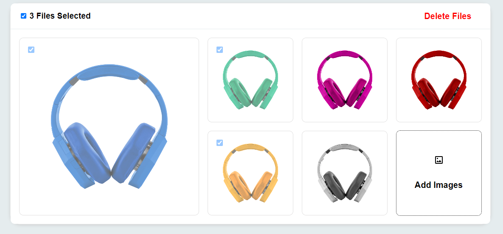

## PROJECT TITLE

React JS Image Gallery

## PROJECT DESCRIPTION

A responsive image gallery built with React JS. This gallery features reordering, deleting multiple images, and setting a feature image. It provides a seamless user experience and an attractive layout.

## Features

- Grid layout for the image gallery.
- Adding/Uploading image from device in that gallery.
- Reordering functionality with drag-and-drop.
- Ability to select and delete multiple images.
- Setting a feature image by sorting.
- Smooth and responsive user experience.
- Polished look and feel with transitions and animations.

## 💻 Tech Stack

- Framework: [React](https://legacy.reactjs.org/docs/getting-started.html)
- Code Formatting: [Prettier](https://prettier.io/)

## ⌨️ Development

## Installation

1. Clone the repository using the following command:

```bash
git clone git@github.com:polin103109/fresher-react-js-task-olliyo.git
```

2. Navigate to the project directory:

```
cd gallery-project
```

3. Install the dependencies:

```
- npm install
- yarn
```

## Usage

1. Start the development server:
   - yarn run dev
2. Open your web browser and access the project at `http://localhost:5173/`
3. Use the gallery to reorder, delete, and set feature images.

## Live Demo

Hosted the gallery on [https://frrr-sigma.vercel.app/](https://frrr-sigma.vercel.app/) for a live preview.

-

# Author

> Front-End Developer | Back-End Developer | React JS Developer | Node JS Developer | JavaScript Programmer

- Sabrina Sharmin
  - `Linkedin` [sabrina sharmin](https://www.linkedin.com/in/sabrina-sharmin-937a441a7/)
  - `Facebook` [Sabrina Sharmin](https://www.facebook.com/sharmin.polin/)
